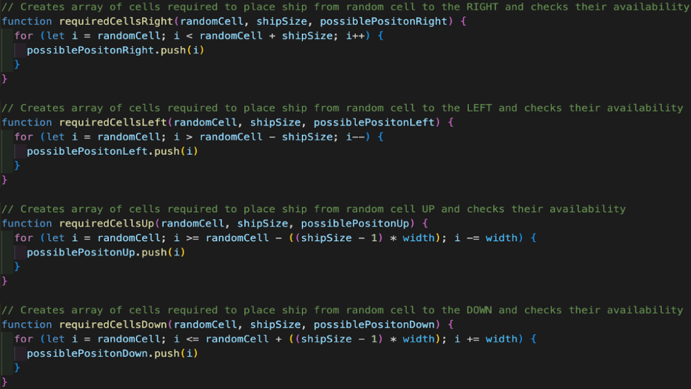

# Battleships Game ReadMe

## Description
For this project, a selection of nine games was provided, and I was required to choose one to build myself using a combination of HTML, CSS, and JavaScript. The game I chose to build was Battleships.

## Deployment Link
https://ross-rogerson.github.io/Battleships/

## Timeframe & Working Team
I was presented with the project brief at 13:30 on Friday 17th February 2023 and had until 14:00 on Friday 24th February 2023 to complete it. This project was to be completed individually.

## Technologies Used
* Visual Studio Code
* GitHub
* HTML
* CSS
* JavaScript
* Excalidraw

## Brief
Battleships is a two-player game where each player covertly lays out their armada of ships on a game board. Each player then takes turns in attempting to hit their opponent's ships by torpedoing specific squares hoping to hit an opponent’s ships. 

The winner is the player that sinks all the opponent’s ships.

### Requirements:
* The game should be one player, with the computer placing its pieces randomly at the start of the game
* The computer should be able to make random attacks on the player’s board

### Suggested enhancements:
* Responsive design
* More intelligent attacks by the computer

## Planning
The first thing I did after deciding to build a Battleships game was to create a wireframe on Excalidraw. Wireframes are an essential part of my planning process as they help me consider in more detail how the HTML should be structured. See below a screenshot of the wireframe I produced for my game at the start of this project.

I planned that the header section would contain the title positioned above four divs: one on each end for avatars, and two in between for comments made by the characters.

Below the header, the main section was intended to be divided into three sub-sections: player components, computer components, and set-up buttons. Within the player components section, there was to be a ten-by-ten grid composed of buttons, positioned above a div containing five buttons, one for each player ship. The computer components section would mirror the player components section, but the computer ships would be represented by divs instead of buttons. The set-up section would consist of a div containing three buttons: 'Start,' 'Reset,' and 'Mute'.

## Build Process
To begin with the JavaScript code for the game, my first task was to achieve random placement of the computer's ships. I recognised that this would be a significant challenge and crucial for the game to start successfully.

To tackle this challenge, I opted for a for loop to iterate over an array that contained details of the ships. Since I needed to store various ship details such as length, hits taken, and position, I created an object for each ship and stored them in an array to be iterated by the for loop.

Next, I decided to implement a while loop for each of the four possible ship orientations: up, down, left, or right. Using a random number between zero and three, I determined the ship's direction. The length of the ship was then passed into the while loop based on the generated random number. This while loop called two additional functions: one to calculate the cells required to place the ship and another to verify the availability of these cells. If any of the cells were already occupied, the loop would start again by generating a new random number and passing it through the functions. This process would repeat until the ship was successfully placed in unoccupied cells. Once a valid position was identified, the corresponding cells were added to an array that stored all cells occupied by the computer's ships.

See below the code snippet showing the initiation of the for loop and one of the nested while loops:

While working on this function, I acknowledged that it would be a memory-intensive process within the game. To address this, I implemented prevalidation in the code responsible for generating the random cell constant. This prevalidation eliminates positions that the ship would be unable to occupy due to its length and the size of the grid. The specific code for prevalidation varies in each while loop, as it is unique to each ship direction.

See below the code used to generate random cells for the placement of ships in each direction: 

For each of the while loops mentioned earlier, I needed a function that could determine the cells that a ship would occupy and create an array to store them. The calculation of these cells varied depending on the ship's facing direction. I determined that the intervals between the cells would be as follows:
* If the ship was facing right, the interval would be +1.
* If the ship was facing left, the interval would be -1.
* If the ship was facing up, the interval would be + the width of the grid.
* If the ship was facing down, the interval would be - the width of the grid.

With this understanding, I utilised a for loop to calculate and store the cells required for ship placement in an array. These arrays could then be used by other functions to validate the ship's placement. See code below:

## Challenges
#### Placing Computer Ships
The initial challenge I encountered was to randomly place the computer's ships on the grid while ensuring that no ships overlapped. To tackle this, I implemented a for loop that iterated through an array of the computer's ships. Within each iteration, a random number between zero and three was generated to represent the four possible directions a ship could face from any given cell: up, down, left, or right. The ship's length was then passed into one of four nested while loops, each corresponding to a specific direction. These while loops generated a random cell and called two additional functions. One function calculated the cells required to place the ship, while the other function verified the availability of these cells. If any of the cells were already occupied, the loop would restart by generating a new random number and calling the functions again, until a valid ship placement was achieved. Once successfully placed, the cells populated by the ship were added to an array that stored all cells occupied by the computer's ships. Please refer to figure 2.0 in the Build Process section for a visual representation.

Additionally, I recognised that this process would be memory-intensive within the game. To optimise it, I introduced prevalidation code to the random cell generation. This code eliminated positions that the ship would be unable to occupy due to its length and the size of the grid. The specific prevalidation code varied for each ship direction and was incorporated into each respective while loop. Please refer to figure 2.1 in the Build Process section for a visual representation.

#### Intelligent Computer Attacks
One of the more challenging aspects of developing this game was implementing the logic for intelligent computer attacks. The objective was to have the computer target cells around a hit until it discovered another part of the player's ship, and then continue targeting that ship until it was destroyed. The difficulty arose in ensuring that the computer did not attack cells surrounding a hit and continue in the direction of a different ship. Instead, it required instructing the computer to continue in the direction of a second hit and, if it missed without destroying the ship, to backtrack in the opposite direction. I addressed this problem by using a sequence of if statements that accounted for all possible ship positions relative to an initial hit.

## Wins
The placement of computer ships was successful. It presented one of the more complex challenges in the game's development, and I am confident in the soundness of my logic and the conciseness of the code I wrote.

I am particularly delighted with the aesthetics of the game. Instead of following the traditional Battleships theme, I chose to incorporate a Toy Story theme. The grids resemble Etch-A-Sketches, and when the reset button is clicked, they shake and clear any elements on the grids.

## Key Takeaways
This project was my first, and it proved to be an excellent learning experience for me. It allowed me to deepen my knowledge of HTML, CSS, and JavaScript, which I had been learning over the past three weeks.

One of the new aspects I explored was incorporating audio into my HTML, which was a first-time endeavor for me. I successfully had audio play in response to certain events.

In JavaScript, I gained proficiency in nesting while loops within a for loop and passing variables into functions called within those loops. Additionally, I successfully utilised conditional statements in JavaScript to apply classes to CSS.

Regarding CSS, I dedicated time to researching animations and successfully incorporated shake and flash animations into my game.

Since I have only been learning to code for three weeks, my familiarity with the terminal and GitHub was limited. However, during this project, I was able to enhance my understanding of both tools and grasp the significance of frequent pushes to GitHub.

## Bugs
-

## Future Improvements
If I had more time I would have enhanced and refactored the logic in the intelligent computer attacks. I would also like to enable the user to change their avatar.
